**ROVER AUTÓNOMO**

Documento de Especificaciones Técnicas

*Versión: 0.1 --- BORRADOR*

Fecha: Abril 2025

Estado: En desarrollo

**1. Resumen del Proyecto**

Este documento describe las especificaciones técnicas del rover autónomo
basado en ESP32-S3, diseñado para exploración y navegación autónoma con
capacidades de detección de obstáculos, control de movimiento y
transmisión de video en tiempo real.

> *📝 Documento vivo: las especificaciones se irán completando a medida
> que se definan los componentes y decisiones de diseño.*

**2. Arquitectura General del Sistema**

El sistema se compone de dos unidades de procesamiento principales:

1.  Unidad Principal (ESP32-S3): control de motores, navegación y
    sensores.

2.  Unidad de Cámara (ESP32-CAM): captura y transmisión de video vía
    WiFi.

### 2.1 Bus I2C Compartido e Interfaz de Sensores

Para optimizar el conexionado y el uso de pines GPIO, los periféricos principales se distribuyen de la siguiente manera:
1.  **Bus I2C Compartido**: La pantalla OLED SSD1306 (`0x3C`), el controlador PWM PCA9685 (`0x40`) y la IMU MPU-6050 (`0x68`) comparten un único bus I2C (`GPIO 4` y `GPIO 5`) conectado a través de una bornera distribuidora. El pin `GPIO 6` queda reservado como línea de interrupción (INT) de la IMU si fuera requerida.
2.  **Interfaz Directa GPIO**: El sensor de distancia ultrasónico RCWL-9610A se conecta directamente a pines GPIO dedicados (`GPIO 9` para TRIG y `GPIO 10` para ECHO) para evitar problemas de bus e inestabilidad I2C.

### 2.2 Zumbador (Buzzer) Activo Dedicado
Para proveer alertas sonoras y retroalimentación de estado (como el sonido de inicio o advertencias de proximidad por obstáculos), el rover utiliza un zumbador (buzzer) activo conectado a un pin GPIO dedicado del ESP32-S3 (`GPIO 16`). Esto simplifica el sistema de audio, reduciendo el consumo de RAM/Flash al eliminar el subsistema I2S y la reproducción de archivos WAV, liberando además los pines `GPIO 17` y `GPIO 18`.

### 2.3 IMU MPU-6050 y Navegación Asistida
El acelerómetro y giróscopo de 6 ejes MPU-6050 está completamente integrado al bus I2C compartiendo la dirección `0x68`. Proporciona telemetría de orientación tridimensional en tiempo real (Pitch, Roll, Yaw) al Dashboard Web y permite ejecutar giros automatizados de alta precisión (`girar_grados`) mediante la integración temporal de velocidad angular (giroscopio eje Z) a 50 Hz. Las maniobras de giro incluyen un escaneo sonar previo ("Look-Before-Turn") a ±85° durante 3 segundos y un lazo de monitoreo frontal para parada de emergencia ante obstáculos.

El conexionado general se realiza de la siguiente forma (usando tracción y giro diferencial con dos motores independientes mediante el driver de motores DRV8833 y sin servo de dirección física):

```mermaid
flowchart TD
    subgraph ESP32-S3 ["ESP32-S3 (Unidad Principal)"]
        gpio4["GPIO 4 (SDA)"]
        gpio5["GPIO 5 (SCL)"]
        gpio9["GPIO 9 (TRIG)"]
        gpio10["GPIO 10 (ECHO)"]
        gpio16["GPIO 16 (BUZZER)"]
        gpio6["GPIO 6 (INT IMU)"]
        vcc33["3.3V (VCC)"]
        vcc50["5V (VCC)"]
        gnd["GND"]
    end

    subgraph Distribuidor ["Bornera I2C (Distribuidor)"]
        sda_bus["SDA Bus"]
        scl_bus["SCL Bus"]
    end

    subgraph Sonar ["RCWL-9610A (Sensor Sonar)"]
        sonar_trig["TRIG"]
        sonar_echo["ECHO"]
        sonar_vcc["VCC"]
        sonar_gnd["GND"]
    end

    subgraph OLED ["OLED SSD1306 (0x3C)"]
        oled_sda["SDA"]
        oled_scl["SCL"]
        oled_vcc["VCC"]
        oled_gnd["GND"]
    end

    subgraph PCA ["PCA9685 (0x40)"]
        pca_sda["SDA"]
        pca_scl["SCL"]
        pca_ch0["Canal 0 (Motor Izq - IN1)"]
        pca_ch1["Canal 1 (Motor Izq - IN2)"]
        pca_ch2["Canal 2 (Motor Der - IN3)"]
        pca_ch3["Canal 3 (Motor Der - IN4)"]
        pca_ch4["Canal 4 (Servo Sonar)"]
        pca_vcc["VCC"]
        pca_gnd["GND"]
    end

    subgraph Buzzer ["Buzzer Activo"]
        buzzer_sig["SIG"]
        buzzer_vcc["VCC"]
        buzzer_gnd["GND"]
    end

    subgraph DRV8833 ["Driver DRV8833 (Puente H)"]
        drv_in1["IN1"]
        drv_in2["IN2"]
        drv_in3["IN3"]
        drv_in4["IN4"]
        drv_out1["OUT1"]
        drv_out2["OUT2"]
        drv_out3["OUT3"]
        drv_out4["OUT4"]
        drv_vcc["VCC (Batería)"]
        drv_gnd["GND"]
    end

    subgraph IMU ["IMU MPU-6050 (0x68)"]
        imu_sda["SDA"]
        imu_scl["SCL"]
        imu_int["INT"]
    end

    %% Layout constraints to force vertical stacking of subgraphs
    gnd ~~~ sda_bus
    sda_bus ~~~ sonar_gnd
    sonar_gnd ~~~ oled_gnd
    oled_gnd ~~~ pca_gnd
    pca_gnd ~~~ buzzer_gnd
    buzzer_gnd ~~~ drv_gnd
    drv_gnd ~~~ imu_int

    %% I2C Connections
    gpio4 --> sda_bus
    gpio5 --> scl_bus

    sda_bus --> pca_sda
    scl_bus --> pca_scl

    sda_bus --> oled_sda
    scl_bus --> oled_scl

    sda_bus --> imu_sda
    scl_bus --> imu_scl
    gpio6 --> imu_int

    %% Sonar Connections
    gpio9 --> sonar_trig
    gpio10 --> sonar_echo

    %% Buzzer Connections
    gpio16 --> buzzer_sig

    %% PCA9685 to DRV8833 Connections
    pca_ch0 --> drv_in1
    pca_ch1 --> drv_in2
    pca_ch2 --> drv_in3
    pca_ch3 --> drv_in4

    %% Power Connections (Logic)
    vcc33 -.-> sonar_vcc
    gnd -.-> sonar_gnd
    vcc33 -.-> oled_vcc
    gnd -.-> oled_gnd
    vcc33 -.-> pca_vcc
    gnd -.-> pca_gnd
    vcc33 -.-> buzzer_vcc
    gnd -.-> buzzer_gnd
    gnd -.-> drv_gnd
    bateria["Batería LiPo 7.4V"] -.-> drv_vcc

    %% Actuator Connections
    pca_ch4 --> servo_sonar["Servo Sonar (SG90)"]
    drv_out1 --> motor_izq["Motor DC Izq"]
    drv_out2 --> motor_izq
    drv_out3 --> motor_der["Motor DC Der"]
    drv_out4 --> motor_der

    classDef esp32Fill fill:#2c3e50,stroke:#34495e,color:#ffffff,font-size:12px;
    classDef bornFill fill:#7f8c8d,stroke:#95a5a6,color:#ffffff,font-size:12px;
    classDef sonarFill fill:#16a085,stroke:#1abc9c,color:#ffffff,font-size:12px;
    classDef oledFill fill:#1e272e,stroke:#05c46b,color:#00d8d6,font-size:12px;
    classDef pcaFill fill:#3498db,stroke:#2980b9,color:#ffffff,font-size:12px;
    classDef buzzerFill fill:#8e44ad,stroke:#9b59b6,color:#ffffff,font-size:12px;
    classDef drvFill fill:#e74c3c,stroke:#c0392b,color:#ffffff,font-size:12px;
    classDef imuFill fill:#d35400,stroke:#e67e22,color:#ffffff,font-size:12px;
    classDef actFill fill:#27ae60,stroke:#2ecc71,color:#ffffff,font-size:12px;

    class gpio4,gpio5,gpio9,gpio10,gpio16,gpio6,vcc33,gnd esp32Fill;
    class sda_bus,scl_bus bornFill;
    class sonar_trig,sonar_echo,sonar_vcc,sonar_gnd sonarFill;
    class oled_sda,oled_scl,oled_vcc,oled_gnd oledFill;
    class pca_sda,pca_scl,pca_ch0,pca_ch1,pca_ch2,pca_ch3,pca_ch4,pca_vcc,pca_gnd pcaFill;
    class buzzer_sig,buzzer_vcc,buzzer_gnd buzzerFill;
    class drv_in1,drv_in2,drv_in3,drv_in4,drv_out1,drv_out2,drv_out3,drv_out4,drv_vcc,drv_gnd drvFill;
    class imu_sda,imu_scl,imu_int imuFill;
    class servo_sonar,motor_izq,motor_der actFill;
```

> 💡 **Diagrama interactivo**: El diagrama de conexión detallado está disponible en el archivo de Draw.io: [rover_conexion.drawio](file:///c:/Users/sclasen/Documents/Archivos%20personales/Antigravity/ESP/docs/assets/rover_conexion.drawio)

**3. Especificaciones de Componentes**

**3.1 Unidad de Control Principal**

**NodeMCU WiFi Bluetooth ESP32-S3 --- 44 Pines + Base Screwshield**

  -------------------------- --------------------------------------------------------------
  **Parámetro**              Valor
  **Modelo**                 NodeMCU ESP32-S3
  **Pines**                  44 pines GPIO
  **Base**                   Screwshield (conexión por tornillo)
  **Firmware / Runtime**     MicroPython
  **Conectividad**           WiFi 802.11 b/g/n + Bluetooth 5.0 (LE)
  **Procesador**             Xtensa LX7 dual-core (hasta 240 MHz)
  **Memoria Flash**          Por definir según variante
  **PSRAM**                  Por definir según variante
  **Interfaces**             I2C, SPI, UART, PWM, ADC, DAC
  **Tensión de operación**   3.3 V (alimentación 5 V via USB o VIN)
  **Notas**                  La screwshield facilita conexiones robustas para prototipado
  -------------------------- --------------------------------------------------------------

> *📝 Decisión: se utilizará MicroPython como entorno de desarrollo
> principal para facilitar la iteración rápida.*

**3.2 Controlador PWM / Servos**

**PCA9685 --- Controlador 16 Canales I2C PWM**

  ---------------------------- -------------------------------------------------
  **Parámetro**                Valor
  **Modelo**                   PCA9685
  **Interfaz con MCU**         I2C
  **Canales PWM**              16 canales independientes
  **Resolución PWM**           12 bits (4096 pasos)
  **Frecuencia PWM**           24 Hz -- 1526 Hz (ajustable)
  **Tensión de lógica**        3.3 V / 5 V compatible
  **Tensión de servos (V+)**   Alimentación externa recomendada
  **Dirección I2C base**       0x40 (configurable via pines A0--A5)
  **Uso en el proyecto**       Control del driver de motores DRV8833 (Canales 0-3) y servo de sonar (Canal 4)
  **Librería MicroPython**     Por definir
  ---------------------------- -------------------------------------------------

> *📝 Decisión: el PCA9685 libera los pines PWM del ESP32-S3 y permite
> controlar múltiples actuadores desde un solo bus I2C.*

**3.3 Sensor de Distancia**

**RCWL-9610A --- Sensor Ultrasónico (Modo GPIO Tradicional)**

  -------------------------- -----------------------------------------------------------------------------
  **Parámetro**              Valor
  **Modelo**                 RCWL-9610A / HC-SR04
  **Tecnología**             Ultrasonido
  **Rango de medición**      2 cm -- 400 cm
  **Resolución**             ~0.3 cm
  **Ángulo de detección**    ~15°
  **Tensión de operación**   3.3 V o 5 V (se alimenta a 3.3V para niveles lógicos seguros)
  **Corriente**              ~15 mA
  **Interfaz con MCU**       GPIO Trig/Echo (TRIG: GPIO 9, ECHO: GPIO 10)
  **Dirección I2C base**     N/A (Se utiliza en modo GPIO tradicional, sin soldar jumper I2C)
  **Montaje**                Sobre servo rotativo (ver sección 3.4)
  -------------------------- -----------------------------------------------------------------------------

> *📝 Decisión: Finalmente no se pudo hacer funcionar el sensor sonar mediante comunicación I2C de manera estable, por lo que se mantuvo el método tradicional por GPIO (TRIG en GPIO 9 y ECHO en GPIO 10) utilizando pines dedicados. Esto garantiza lecturas fiables y estables sin riesgo de bloqueos en el bus I2C.*

**3.4 Servo de Orientación del Sonar**

  ------------------- ----------------------------------------------------
  **Parámetro**       Valor
  **Función**         Rotar el sensor HC-SR04 para barrido lateral
  **Tipo**            Micro servo
  **Rango de giro**   ±85° respecto al eje frontal (170° útil acotado por software)
  **Control**         Canal 4 PWM del PCA9685 (Rango seguro: duty center 307 ± 145)
  **Estrategia**      Movimiento asíncrono suave (`set_servo_angle_smooth`) en pasos de 5° y auto-apagado de señal PWM (`apagar_servo`) al finalizar posicionamiento
  **Montaje**         Solidario al chasis, HC-SR04 fijo al eje del servo
  **Modelo servo**    SG90
  ------------------- ----------------------------------------------------

> *📝 Decisión: el servo de sonar se controla desde el PCA9685 en Canal 4. Tras solucionar la alimentación del servo por hardware, la excursión se extiende a ±85°, aplicando un movimiento suavizado por pasos asíncronos y apagar el pulso PWM tras cada movimiento.*

**3.5 Unidad de Cámara**

**ESP32-CAM --- Módulo WiFi/BT con Cámara OV2640 2MP**

  -------------------------------- -------------------------------------------------------
  **Parámetro**                    Valor
  **Modelo**                       ESP32-CAM (AI-Thinker o compatible)
  **MCU integrado**                ESP32 dual-core
  **Sensor de imagen**             OV2640 2MP
  **Resolución máxima**            1600 × 1200 (UXGA)
  **Modos de resolución**          QQVGA a UXGA
  **Formato de salida**            JPEG, BMP, RAW
  **Conectividad**                 WiFi 802.11 b/g/n
  **Alimentación**                 5 V / 3.3 V (ver datasheet)
  **Flash LED integrado**          Sí (LED blanco)
  **Interfaz con MCU principal**   WiFi (streaming) / UART (por definir)
  **Firmware**                     Por definir (Arduino / ESP-IDF / MicroPython parcial)
  **Uso en el proyecto**           Streaming de video en tiempo real
  -------------------------------- -------------------------------------------------------

> *📝 Pendiente: definir protocolo de comunicación entre ESP32-S3 y
> ESP32-CAM (streaming HTTP/RTSP via WiFi o UART para comandos).*

**3.6 Pantalla de Telemetría OLED**

**SSD1306 --- Pantalla OLED 0.96" 128x64**

  ---------------------------- -------------------------------------------------
  **Parámetro**                Valor
  **Modelo**                   SSD1306 (OLED 0.96 Pulgadas)
  **Resolución**               128 x 64 píxeles (monocromo)
  **Interfaz con MCU**         I2C (SDA, SCL, VCC, GND)
  **Dirección I2C base**       0x3C
  **Tensión de lógica/VCC**    3.3 V
  **Uso en el proyecto**       Mostrar el estado de red, IP, telemetría y diagnóstico
  ---------------------------- -------------------------------------------------

> *📝 Decisión: La pantalla OLED SSD1306 se integra al mismo bus I2C del ESP32-S3 para mostrar información local del rover sin añadir cables GPIO adicionales.*

**3.7 Zumbador (Buzzer) Activo**

**Buzzer Activo --- Pitidos y Alertas de Estado**

  ---------------------------- -------------------------------------------------
  **Parámetro**                Valor
  **Modelo**                   Buzzer Activo (zumbador)
  **Interfaz con MCU**         GPIO Directo (ON/OFF)
  **Tensión de alimentación**  3.3 V (directamente desde pin de control)
  **Pin de control**           GPIO 16
  **Uso en el proyecto**       Pitido corto al completar inicialización y tonos intermitentes de advertencia por proximidad de obstáculos
  ---------------------------- -------------------------------------------------

> *📝 Decisión: El rover no cuenta con reproducción de voz ni salida I2S. En su lugar, se utiliza un buzzer activo en el pin GPIO 16, lo que simplifica enormemente el firmware y el hardware, liberando además los pines GPIO 17 y GPIO 18.*

**3.8 Driver de Motores DC**

**DRV8833 --- Puente H de 2 Canales**

  ---------------------------- -------------------------------------------------
  **Parámetro**                Valor
  **Modelo**                   DRV8833 (Puente H Doble)
  **Canales**                  2 canales independientes (para 2 motores DC)
  **Corriente de salida**      1.5 A por canal (pico 2 A)
  **Tensión de alimentación**  2.7 V -- 10.8 V (alimentado desde batería LiPo 7.4V)
  **Señales de control**       4 entradas PWM desde PCA9685 (IN1/IN2 para motor izquierdo, IN3/IN4 para motor derecho)
  **Frecuencia PWM**           50 Hz (configurada en el PCA9685)
  **Lógica de control**        Giro adelante (IN1=PWM, IN2=0), giro atrás (IN1=0, IN2=PWM), freno activo (IN1=IN2=HIGH/4095)
  **Uso en el proyecto**       Tracción trasera del rover con giro diferencial (sin servo de dirección física)
  ---------------------------- -------------------------------------------------

> *📝 Decisión: El uso del puente H DRV8833 permite el control bidireccional y de velocidad (PWM) de los dos motores DC utilizando canales dedicados del PCA9685. Esto evita consumir pines de alta corriente o PWM directos del ESP32-S3.*

**3.9 Acelerómetro / Giróscopo IMU**

**MPU-6050 --- Sensor de Inercia de 6 Ejes (6-DOF)**

  ---------------------------- -------------------------------------------------
  **Parámetro**                Valor
  **Modelo**                   MPU-6050
  **Interfaz con MCU**         I2C
  **Dirección I2C base**       0x68 (AD0 a GND)
  **Acelerómetro**             3 ejes, escala ±2g (sensibilidad 16384 LSB/g)
  **Giróscopo**                3 ejes, escala ±250°/s (sensibilidad 131 LSB/°/s)
  **Sensor de Temperatura**    Integrado (-40°C a +85°C)
  **Tensión de alimentación**  3.3 V
  **Pin de interrupción**      GPIO 6 (opcional / reservado)
  **Uso en el proyecto**       Telemetría 3D de orientación (Pitch/Roll) en Dashboard Web y giros automatizados de precisión asistidos por giroscopio (`girar_grados`)
  ---------------------------- -------------------------------------------------

> *📝 Decisión: La IMU MPU-6050 se encuentra totalmente integrada en la dirección I2C 0x68. Proporciona telemetría angular 3D en tiempo real y permite rotaciones precisas sin desplazamiento por deslizamiento de ruedas.*

**3.10 Servidor Web Async, Telemetría y Dashboard 3D**

**Microdot Asyncio --- Servidor Web HTTP, WebSockets y Dashboard**

  ---------------------------- -------------------------------------------------
  **Parámetro**                Valor
  **Servidor HTTP**            Microdot Asyncio en Puerto 80
  **WebSockets**               `/ws` para envío continuo de telemetría (~5Hz) y recepción de comandos
  **Interfaz Dashboard**       Single Page App (SPA) HTML5/JS con visor 3D de la IMU, control por teclado (flechas / WASD), botones de giro rápido 90° e indicador de RAM
  **Actualizaciones OTA**      Endpoint `/update` para flasheo remoto Over-The-Air desde repositorio GitHub
  ---------------------------- -------------------------------------------------

> *📝 Decisión: La arquitectura asíncrona basada en Microdot permite transmitir telemetría y responder a comandos en tiempo real sin bloquear los bucles de control de motores, sonar o seguridad.*

**4. Decisiones de Diseño**

  ----------------------------- -------------------------------------------------------------------------------------
  **Decisión**                  Justificación
  **MicroPython en ESP32-S3**   Desarrollo ágil, sintaxis accesible, buenas librerías para I2C y PWM
  **PCA9685 vía I2C**           Libera pines del MCU, permite múltiples servos/motores con un bus
  **Sonar sobre servo**         Permite barrido angular de obstáculos sin multiplexar varios sensores
  **ESP32-CAM separado**        Delega el procesamiento de imagen a una unidad dedicada, no satura el MCU principal
  **Sonar por GPIO (Trig/Echo)** Sonar en GPIO 9 (TRIG) y GPIO 10 (ECHO) usando el método tradicional tras comprobar inestabilidad técnica por bus I2C
  **Buzzer Activo (GPIO 16)**   Uso de zumbador activo simple en GPIO 16 en lugar de I2S (MAX98357A) para simplificar software/hardware y liberar pines GPIO 17 y 18
  **IMU MPU-6050 en I2C (0x68)** Conectar el acelerómetro/giróscopo al bus I2C común (`GPIO 4`/`5`) para telemetría 3D y giros asistidos por giroscopio
  **Puente H DRV8833**          Control de motores traseros DC usando 2 canales PWM del PCA9685 por motor para velocidad, sentido y freno activo
  **Protección PWM Servo**      Movimiento suavizado por pasos asíncronos en rango acotado [-85°, 85°] y apagado automático de señal PWM al finalizar para prevenir desgaste
  **Giro Controlado Gyro Z**    Lazo de integración angular a 50Hz con calibración inicial de offset, escaneo preventivo "Look-Before-Turn" y freno de emergencia por sonar frontal
  **Web Server Microdot & WS**  Servidor HTTP/WebSocket asíncrono para telemetría en vivo, dashboard con visor 3D, control por teclado y soporte de actualización OTA
  ----------------------------- -------------------------------------------------------------------------------------

**5. Pendientes y Próximos Pasos**

-   [x] Definir control y alimentación de motores DC de tracción trasera (giro diferencial con puente H DRV8833). *(Completado v0.6)*
-   [x] Integración de IMU MPU-6050 y giros de precisión asistidos por giroscopio. *(Completado v0.7)*
-   [x] Servidor Web de monitoreo en tiempo real, telemetría 3D y soporte OTA. *(Completado v0.7)*
-   Definir protocolo de comunicación ESP32-S3 ↔ ESP32-CAM (streaming de video).
-   Especificar chasis definitivo y gestión integrada de batería LiPo / sensores de voltaje.
-   Agregar diagrama de bloques simplificado del sistema.

**6. Asignación de Pines del ESP32-S3**

  -------------- ---------------------- ---------------------------------------------------- ---------------
  **Pin GPIO**   **Función**            **Componente**                                       **Dirección**
  **GPIO 4**     SDA (I2C Datos)        Bus I2C Compartido (PCA9685, SSD1306, MPU-6050)      Bidireccional
  **GPIO 5**     SCL (I2C Reloj)        Bus I2C Compartido (PCA9685, SSD1306, MPU-6050)      Salida (OUT)
  **GPIO 6**     INT (Interrupción)     Reservado para acelerómetro/giróscopo (MPU-6050)    Entrada (IN)
  **GPIO 9**     TRIG Sonar             Sensor Ultrasónico RCWL-9610A (Método Tradicional)   Salida (OUT)
  **GPIO 10**    ECHO Sonar             Sensor Ultrasónico RCWL-9610A (Método Tradicional)   Entrada (IN)
  **GPIO 16**    Buzzer (Alarma)        Zumbador (Buzzer) Activo                             Salida (OUT)
  **GPIO 17**    Libre                  N/A                                                  -
  **GPIO 18**    Libre                  N/A                                                  -
  **GPIO 48**    LED RGB NeoPixel       NeoPixel integrado en placa (1 LED)                  Salida (OUT)
  -------------- ---------------------- ---------------------------------------------------- ---------------

**7. Historial de Revisiones**

  ---------------------- -----------------------------------------------------------------------------------------------------
  **Versión**            Descripción
  **0.1 --- Abr 2025**   Creación inicial. Componentes principales definidos: ESP32-S3, PCA9685, HC-SR04 + servo, ESP32-CAM.
  **0.2 --- Jun 2026**   Migración a sensor de distancia I2C (RCWL-9610A) y pantalla OLED SSD1306, unificando el bus I2C.
  **0.3 --- Jul 2026**   Retorno de sensor de distancia (RCWL-9610A) a pines GPIO 9 (TRIG) y 10 (ECHO) por estabilidad del bus I2C.
  **0.4 --- Jul 2026**   Eliminación de servo de dirección física. Configuración de giro diferencial usando motores traseros independientes.
  **0.5 --- Jul 2026**   Adición de especificación de audio con módulo amplificador I2S MAX98357A y altavoz de 8Ω, asignando los pines GPIO 16, 17 y 18. Previsión de bus I2C compartido para IMU y reserva de GPIO 6 como interrupción.
  **0.6 --- Jul 2026**   Simplificación de audio: reemplazo de I2S MAX98357A por un buzzer activo en GPIO 16, liberando GPIO 17 y 18. Confirmación definitiva de sonar por método GPIO tradicional por imposibilidad de hacerlo andar estable en I2C. Adición de especificación del driver de motor DC DRV8833 controlado con 2 canales del PCA9685 por motor.
  **0.7 --- Jul 2026**   Integración completa de IMU MPU-6050 (0x68) para telemetría 3D y giros automatizados asistidos por giroscopio (`girar_grados` con escaneo preventivo sonar y parada de emergencia frontal). Protección de servo sonar (SG90) limitando el rango seguro a ±70°, movimiento asíncrono suave por pasos y auto-apagado de pulso PWM. Servidor Web Microdot con WebSocket, telemetría en vivo, control por teclado y soporte OTA.
  ---------------------- -----------------------------------------------------------------------------------------------------
