**ROVER AUTÓNOMO**

Documento de Especificaciones Técnicas

*Versión: 0.1 --- BORRADOR*

Fecha: Abril 2025

Estado: En desarrollo

**1. Resumen del Proyecto**

Este documento describe las especificaciones técnicas del rover autónomo
basado en ESP32-S3, diseñado para exploración y navegación autónoma con
capacidades de detección de obstáculos, control de movimiento y
transmisión de video en tiempo real.

> *📝 Documento vivo: las especificaciones se irán completando a medida
> que se definan los componentes y decisiones de diseño.*

**2. Arquitectura General del Sistema**

El sistema se compone de dos unidades de procesamiento principales:

1.  Unidad Principal (ESP32-S3): control de motores, navegación y
    sensores.

2.  Unidad de Cámara (ESP32-CAM): captura y transmisión de video vía
    WiFi.

### 2.1 Bus I2C Compartido e Interfaz de Sensores

Para optimizar el conexionado y el uso de pines GPIO, los periféricos principales se distribuyen de la siguiente manera:
1.  **Bus I2C Compartido**: La pantalla OLED SSD1306 y el controlador PWM PCA9685 comparten un único bus I2C (`GPIO 4` y `GPIO 5`) conectado a través de una bornera distribuidora. En el futuro, el acelerómetro/giróscopo (IMU) compartirá este mismo bus I2C, reservando el `GPIO 6` en caso de que requiera línea de interrupción.
2.  **Interfaz Directa GPIO**: El sensor de distancia ultrasónico RCWL-9610A se conecta directamente a pines GPIO dedicados (`GPIO 9` para TRIG y `GPIO 10` para ECHO) para evitar problemas de bus y latencias.

### 2.2 Interfaz de Audio I2S Dedicada
Para dotar de voz al rover, se integra el módulo amplificador MAX98357A mediante una interfaz digital I2S dedicada, utilizando tres pines GPIO libres del ESP32-S3 (`GPIO 18` para DIN, `GPIO 17` para BCLK, y `GPIO 16` para LRC).

El conexionado general se realiza de la siguiente forma (usando tracción y giro diferencial con dos motores independientes y sin servo de dirección física):

```mermaid
graph TD
    subgraph ESP32-S3 ["ESP32-S3 (Unidad Principal)"]
        gpio4["GPIO 4 (SDA)"]
        gpio5["GPIO 5 (SCL)"]
        gpio9["GPIO 9 (TRIG)"]
        gpio10["GPIO 10 (ECHO)"]
        gpio18["GPIO 18 (DIN I2S)"]
        gpio17["GPIO 17 (BCLK I2S)"]
        gpio16["GPIO 16 (LRC I2S)"]
        gpio6["GPIO 6 (INT IMU)"]
        vcc33["3.3V (VCC)"]
        vcc50["5V (VCC)"]
        gnd["GND"]
    end

    subgraph Distribuidor ["Bornera I2C (Distribuidor)"]
        sda_bus["SDA Bus"]
        scl_bus["SCL Bus"]
    end

    subgraph Sonar ["RCWL-9610A (Sensor Sonar)"]
        sonar_trig["TRIG"]
        sonar_echo["ECHO"]
        sonar_vcc["VCC"]
        sonar_gnd["GND"]
    end

    subgraph OLED ["OLED SSD1306 (0x3C)"]
        oled_sda["SDA"]
        oled_scl["SCL"]
        oled_vcc["VCC"]
        oled_gnd["GND"]
    end

    subgraph PCA ["PCA9685 (0x40)"]
        pca_sda["SDA"]
        pca_scl["SCL"]
        pca_ch0["Canal 0 (Motor Izq)"]
        pca_ch1["Canal 1 (Motor Der)"]
        pca_ch4["Canal 4 (Servo Sonar)"]
        pca_vcc["VCC"]
        pca_gnd["GND"]
    end

    subgraph Audio ["MAX98357A (Amplificador I2S)"]
        amp_din["DIN"]
        amp_bclk["BCLK"]
        amp_lrc["LRC"]
        amp_vin["VIN"]
        amp_gnd["GND"]
        amp_gain["GAIN (3dB)"]
        amp_outp["OUT+"]
        amp_outn["OUT-"]
    end

    subgraph IMU ["IMU (Futuro Acel/Giro)"]
        imu_sda["SDA"]
        imu_scl["SCL"]
        imu_int["INT"]
    end

    %% Layout constraints to force vertical stacking of subgraphs
    gnd ~~~ sda_bus
    sda_bus ~~~ sonar_gnd
    sonar_gnd ~~~ oled_gnd
    oled_gnd ~~~ pca_gnd
    pca_gnd ~~~ amp_gnd
    amp_gnd ~~~ imu_int

    %% I2C Connections
    gpio4 --> sda_bus
    gpio5 --> scl_bus

    sda_bus --> pca_sda
    scl_bus --> pca_scl

    sda_bus --> oled_sda
    scl_bus --> oled_scl

    sda_bus --> imu_sda
    scl_bus --> imu_scl
    gpio6 --> imu_int

    %% Sonar Connections
    gpio9 --> sonar_trig
    gpio10 --> sonar_echo

    %% I2S Audio Connections
    gpio18 --> amp_din
    gpio17 --> amp_bclk
    gpio16 --> amp_lrc

    %% Power Connections (Logic)
    vcc33 -.-> sonar_vcc
    gnd -.-> sonar_gnd
    vcc33 -.-> oled_vcc
    gnd -.-> oled_gnd
    vcc33 -.-> pca_vcc
    gnd -.-> pca_gnd
    vcc50 -.-> amp_vin
    gnd -.-> amp_gnd
    vcc50 -.-> amp_gain

    %% Actuator Connections
    pca_ch4 --> servo_sonar["Servo Sonar (SG90)"]
    pca_ch0 --> motor_izq["ESC / Motor Izq (Tracción/Giro)"]
    pca_ch1 --> motor_der["ESC / Motor Der (Tracción/Giro)"]
    amp_outp --> altavoz["Altavoz 8Ω 0.25W"]
    amp_outn --> altavoz

    classDef esp32Fill fill:#2c3e50,stroke:#34495e,color:#ffffff,font-size:12px;
    classDef bornFill fill:#7f8c8d,stroke:#95a5a6,color:#ffffff,font-size:12px;
    classDef sonarFill fill:#16a085,stroke:#1abc9c,color:#ffffff,font-size:12px;
    classDef oledFill fill:#1e272e,stroke:#05c46b,color:#00d8d6,font-size:12px;
    classDef pcaFill fill:#3498db,stroke:#2980b9,color:#ffffff,font-size:12px;
    classDef audioFill fill:#8e44ad,stroke:#9b59b6,color:#ffffff,font-size:12px;
    classDef imuFill fill:#d35400,stroke:#e67e22,color:#ffffff,font-size:12px;
    classDef actFill fill:#27ae60,stroke:#2ecc71,color:#ffffff,font-size:12px;

    class gpio4,gpio5,gpio9,gpio10,gpio16,gpio17,gpio18,gpio6,vcc33,gnd esp32Fill;
    class sda_bus,scl_bus bornFill;
    class sonar_trig,sonar_echo,sonar_vcc,sonar_gnd sonarFill;
    class oled_sda,oled_scl,oled_vcc,oled_gnd oledFill;
    class pca_sda,pca_scl,pca_ch0,pca_ch1,pca_ch4,pca_vcc,pca_gnd pcaFill;
    class amp_din,amp_bclk,amp_lrc,amp_vin,amp_gnd,amp_gain,amp_outp,amp_outn audioFill;
    class imu_sda,imu_scl,imu_int imuFill;
    class servo_sonar,motor_izq,motor_der,altavoz actFill;
```

> 💡 **Diagrama interactivo**: El diagrama de conexión detallado está disponible en el archivo de Draw.io: [rover_conexion.drawio](file:///c:/Users/sclasen/Documents/Archivos%20personales/Antigravity/ESP/docs/assets/rover_conexion.drawio)

**3. Especificaciones de Componentes**

**3.1 Unidad de Control Principal**

**NodeMCU WiFi Bluetooth ESP32-S3 --- 44 Pines + Base Screwshield**

  -------------------------- --------------------------------------------------------------
  **Parámetro**              Valor
  **Modelo**                 NodeMCU ESP32-S3
  **Pines**                  44 pines GPIO
  **Base**                   Screwshield (conexión por tornillo)
  **Firmware / Runtime**     MicroPython
  **Conectividad**           WiFi 802.11 b/g/n + Bluetooth 5.0 (LE)
  **Procesador**             Xtensa LX7 dual-core (hasta 240 MHz)
  **Memoria Flash**          Por definir según variante
  **PSRAM**                  Por definir según variante
  **Interfaces**             I2C, SPI, UART, PWM, ADC, DAC
  **Tensión de operación**   3.3 V (alimentación 5 V via USB o VIN)
  **Notas**                  La screwshield facilita conexiones robustas para prototipado
  -------------------------- --------------------------------------------------------------

> *📝 Decisión: se utilizará MicroPython como entorno de desarrollo
> principal para facilitar la iteración rápida.*

**3.2 Controlador PWM / Servos**

**PCA9685 --- Controlador 16 Canales I2C PWM**

  ---------------------------- -------------------------------------------------
  **Parámetro**                Valor
  **Modelo**                   PCA9685
  **Interfaz con MCU**         I2C
  **Canales PWM**              16 canales independientes
  **Resolución PWM**           12 bits (4096 pasos)
  **Frecuencia PWM**           24 Hz -- 1526 Hz (ajustable)
  **Tensión de lógica**        3.3 V / 5 V compatible
  **Tensión de servos (V+)**   Alimentación externa recomendada
  **Dirección I2C base**       0x40 (configurable via pines A0--A5)
  **Uso en el proyecto**       Control de motores de tracción trasero (giro diferencial) y servo de sonar
  **Librería MicroPython**     Por definir
  ---------------------------- -------------------------------------------------

> *📝 Decisión: el PCA9685 libera los pines PWM del ESP32-S3 y permite
> controlar múltiples actuadores desde un solo bus I2C.*

**3.3 Sensor de Distancia**

**RCWL-9610A --- Sensor Ultrasónico (Modo GPIO)**

  -------------------------- -----------------------------------------------------------------------------
  **Parámetro**              Valor
  **Modelo**                 RCWL-9610A / HC-SR04
  **Tecnología**             Ultrasonido
  **Rango de medición**      2 cm -- 400 cm
  **Resolución**             ~0.3 cm
  **Ángulo de detección**    ~15°
  **Tensión de operación**   3.3 V o 5 V (se alimenta a 3.3V para niveles lógicos seguros)
  **Corriente**              ~15 mA
  **Interfaz con MCU**       GPIO Trig/Echo (TRIG: GPIO 9, ECHO: GPIO 10)
  **Dirección I2C base**     N/A (Se utiliza en modo GPIO, sin soldar jumper I2C)
  **Montaje**                Sobre servo rotativo (ver sección 3.4)
  -------------------------- -----------------------------------------------------------------------------

> *📝 Decisión: Se conecta por GPIO utilizando pines dedicados para garantizar la estabilidad de las lecturas y la inmunidad a fallos del bus I2C bajo carga.*

**3.4 Servo de Orientación del Sonar**

  ------------------- ----------------------------------------------------
  **Parámetro**       Valor
  **Función**         Rotar el sensor HC-SR04 para barrido lateral
  **Tipo**            Micro servo
  **Rango de giro**   ±90° respecto al eje frontal (180° total)
  **Control**         Canal PWM del PCA9685 (Rango Extendido: 0.5 a 2.5ms)
  **Montaje**         Solidario al chasis, HC-SR04 fijo al eje del servo
  **Modelo servo**    SG90
  ------------------- ----------------------------------------------------

> *📝 Decisión: el servo de sonar se controla desde el PCA9685, evitando
> usar pines PWM directos del ESP32-S3.*

**3.5 Unidad de Cámara**

**ESP32-CAM --- Módulo WiFi/BT con Cámara OV2640 2MP**

  -------------------------------- -------------------------------------------------------
  **Parámetro**                    Valor
  **Modelo**                       ESP32-CAM (AI-Thinker o compatible)
  **MCU integrado**                ESP32 dual-core
  **Sensor de imagen**             OV2640 2MP
  **Resolución máxima**            1600 × 1200 (UXGA)
  **Modos de resolución**          QQVGA a UXGA
  **Formato de salida**            JPEG, BMP, RAW
  **Conectividad**                 WiFi 802.11 b/g/n
  **Alimentación**                 5 V / 3.3 V (ver datasheet)
  **Flash LED integrado**          Sí (LED blanco)
  **Interfaz con MCU principal**   WiFi (streaming) / UART (por definir)
  **Firmware**                     Por definir (Arduino / ESP-IDF / MicroPython parcial)
  **Uso en el proyecto**           Streaming de video en tiempo real
  -------------------------------- -------------------------------------------------------

> *📝 Pendiente: definir protocolo de comunicación entre ESP32-S3 y
> ESP32-CAM (streaming HTTP/RTSP via WiFi o UART para comandos).*

**3.6 Pantalla de Telemetría OLED**

**SSD1306 --- Pantalla OLED 0.96" 128x64**

  ---------------------------- -------------------------------------------------
  **Parámetro**                Valor
  **Modelo**                   SSD1306 (OLED 0.96 Pulgadas)
  **Resolución**               128 x 64 píxeles (monocromo)
  **Interfaz con MCU**         I2C (SDA, SCL, VCC, GND)
  **Dirección I2C base**       0x3C
  **Tensión de lógica/VCC**    3.3 V
  **Uso en el proyecto**       Mostrar el estado de red, IP, telemetría y diagnóstico
  ---------------------------- -------------------------------------------------

> *📝 Decisión: La pantalla OLED SSD1306 se integra al mismo bus I2C del ESP32-S3 para mostrar información local del rover sin añadir cables GPIO adicionales.*

**3.7 Módulo de Audio I2S y Altavoz**

**MAX98357A --- Módulo Amplificador de Audio Clase D I2S**

  ---------------------------- -------------------------------------------------
  **Parámetro**                Valor
  **Modelo**                   MAX98357A
  **Interfaz con MCU**         I2S (DIN, BCLK, LRC)
  **Altavoz recomendado**      Altavoz 8Ω 0.25W
  **Configuración de Ganancia** 3 dB (Patilla GAIN conectada directamente a VIN / 5V)
  **Tensión de alimentación**  5.0 V (Recomendado) / 3.3 V (VIN)
  **Canal de audio**           Mono (mezcla interna por defecto)
  **Uso en el proyecto**       Salida de voz, tonos y alertas locales del rover
  ---------------------------- -------------------------------------------------

> *📝 Decisión: El uso de I2S permite una salida de audio digital limpia sin necesidad de DACs analógicos externos complejos, y el amplificador MAX98357A Clase D de alta eficiencia provee suficiente potencia para el altavoz de 8Ω de forma directa.*

**4. Decisiones de Diseño**

  ----------------------------- -------------------------------------------------------------------------------------
  **Decisión**                  Justificación
  **MicroPython en ESP32-S3**   Desarrollo ágil, sintaxis accesible, buenas librerías para I2C y PWM
  **PCA9685 vía I2C**           Libera pines del MCU, permite múltiples servos/motores con un bus
  **Sonar sobre servo**         Permite barrido angular de obstáculos sin multiplexar varios sensores
  **ESP32-CAM separado**        Delega el procesamiento de imagen a una unidad dedicada, no satura el MCU principal
  **I2C Parcial**               Uso de bus I2C solo para PCA9685 y OLED, separando el sonar por GPIO para prevenir bloqueos de bus
  **Audio I2S Dedicado**        Uso de I2S (GPIO 16, 17, 18) para una salida digital limpia y directa al amplificador MAX98357A
  **IMU en I2C Compartido**     Conectar el acelerómetro/giróscopo al bus I2C común (GPIO 4/5) y reservar GPIO 6 para interrupción
  ----------------------------- -------------------------------------------------------------------------------------

**5. Pendientes y Próximos Pasos**

-   Definir detalles de control y alimentación de motores DC de tracción trasera (giro diferencial, sin dirección física).

-   Definir protocolo de comunicación ESP32-S3 ↔ ESP32-CAM.

-   Especificar sistema de alimentación (baterías, reguladores,
    distribución de potencia).

-   Definir chasis y estructura mecánica.

-   Agregar diagrama de bloques del sistema.

**6. Asignación de Pines del ESP32-S3**

  -------------- ---------------------- --------------------------------------------- ---------------
  **Pin GPIO**   **Función**            **Componente**                                **Dirección**
  **GPIO 4**     SDA (I2C Datos)        Bus I2C Compartido (PCA9685, SSD1306, IMU)    Bidireccional
  **GPIO 5**     SCL (I2C Reloj)        Bus I2C Compartido (PCA9685, SSD1306, IMU)    Salida (OUT)
  **GPIO 6**     INT (Interrupción)     Reservado para acelerómetro/giróscopo (IMU)   Entrada (IN)
  **GPIO 9**     TRIG Sonar             Sensor Ultrasónico RCWL-9610A                 Salida (OUT)
  **GPIO 10**    ECHO Sonar             Sensor Ultrasónico RCWL-9610A                 Entrada (IN)
  **GPIO 16**    LRC I2S (Word Select)  Módulo Amplificador de Audio MAX98357A        Salida (OUT)
  **GPIO 17**    BCLK I2S (Bit Clock)   Módulo Amplificador de Audio MAX98357A        Salida (OUT)
  **GPIO 18**    DIN I2S (Data Input)   Módulo Amplificador de Audio MAX98357A        Salida (OUT)
  **GPIO 48**    LED RGB NeoPixel       NeoPixel integrado en placa (1 LED)           Salida (OUT)
  -------------- ---------------------- --------------------------------------------- ---------------

**7. Historial de Revisiones**

  ---------------------- -----------------------------------------------------------------------------------------------------
  **Versión**            Descripción
  **0.1 --- Abr 2025**   Creación inicial. Componentes principales definidos: ESP32-S3, PCA9685, HC-SR04 + servo, ESP32-CAM.
  **0.2 --- Jun 2026**   Migración a sensor de distancia I2C (RCWL-9610A) y pantalla OLED SSD1306, unificando el bus I2C.
  **0.3 --- Jul 2026**   Retorno de sensor de distancia (RCWL-9610A) a pines GPIO 9 (TRIG) y 10 (ECHO) por estabilidad del bus I2C.
  **0.4 --- Jul 2026**   Eliminación de servo de dirección física. Configuración de giro diferencial usando motores traseros independientes.
  **0.5 --- Jul 2026**   Adición de especificación de audio con módulo amplificador I2S MAX98357A y altavoz de 8Ω, asignando los pines GPIO 16, 17 y 18. Previsión de bus I2C compartido para IMU y reserva de GPIO 6 como interrupción.
  ---------------------- -----------------------------------------------------------------------------------------------------
