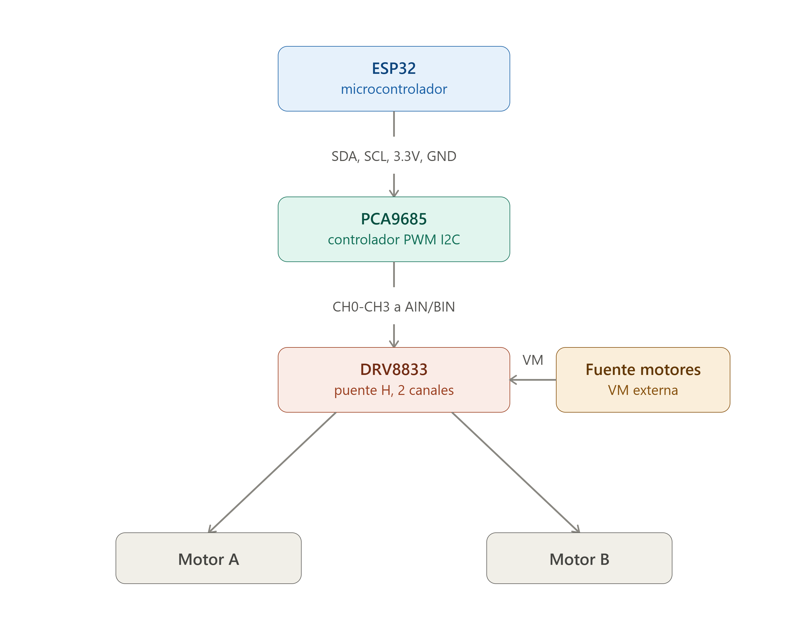
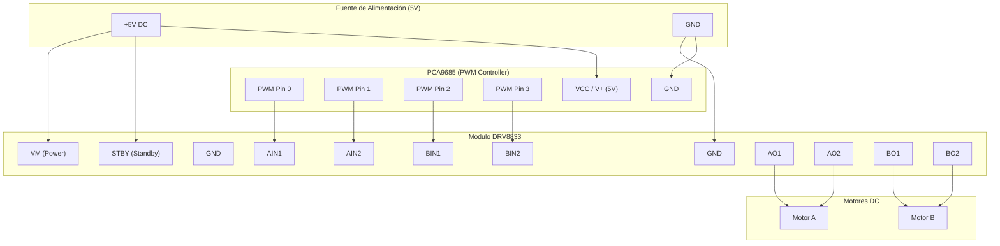

Así queda el flujo de señal: la ESP32 habla por I2C con el PCA9685, y este le entrega 4 señales PWM al DRV8833 para manejar ambos motores.

**Mapeo de pines exacto:**

| ESP32                | →   | PCA9685 |
| ----------------------| -----| ---------|
| 3.3V                 | →   | VCC     |
| GND                  | →   | GND     |
| GPIO21 (por defecto) | →   | SDA     |
| GPIO22 (por defecto) | →   | SCL     |

| PCA9685 | → | DRV8833 |
|---|---|---|
| CH0 | → | AIN1 |
| CH1 | → | AIN2 |
| CH2 | → | BIN1 |
| CH3 | → | BIN2 |

No necesitas conectar el pin **V+** del PCA9685 a nada: ese terminal solo distribuye alimentación a servos, no a las señales PWM en sí. Con VCC alimentado ya tenés las 16 salidas activas.

**Puntos críticos que no se ven en el diagrama pero son clave:**

1. **GND común obligatorio**: la ESP32, el PCA9685, el DRV8833 y la fuente de los motores tienen que compartir el mismo GND (referencia común). Si no, las señales de control no van a funcionar correctamente aunque todo esté "conectado".

2. **No alimentes los motores desde la ESP32**: el pin VM del DRV8833 debe ir a una fuente externa (batería o fuente de pared) acorde a tus motores, normalmente entre 4V y 10.8V. La ESP32 no puede entregar la corriente que consumen motores DC.

3. **Pin STBY**: si tu módulo DRV8833 trae ese pin expuesto, debe estar en HIGH (3.3V) para que el driver funcione; si está en LOW, los motores quedan en reposo. Muchas placas genéricas lo traen ya puenteado a VCC con una resistencia pull-up, pero conviene revisarlo con el multímetro o la serigrafía de tu placa puntual.

4. **Control de dirección y velocidad (modo IN/IN)**: con este esquema, cada motor usa dos canales PWM. Para girar en un sentido, PWMeas una entrada y dejás la otra en 0; para el sentido contrario, invertís cuál PWMeas. Con ambas en 0 el motor queda en "coast" (libre), y con ambas al 100% queda en frenado activo.

5. **Frecuencia del PCA9685**: por defecto suele configurarse a 50 Hz (pensado para servos). Para motores DC conviene subirla a algo como 1000-1500 Hz para evitar el zumbido audible del motor.

